# 数字图像处理作业二：基于PyTorch的图像翻译与泊松融合

学号：BC25038003  姓名：唐晓刚

---

## 一、简介

本实验使用 PyTorch 实现了两个经典的图像处理任务：

1. **Pix2Pix 图像翻译**：用全卷积网络 (FCN) 将建筑照片映射成语义分割图
2. **Poisson 泊松融合**：基于梯度域优化的无缝图像拼接

---

## 二、环境配置

- Python 3.8+, PyTorch 1.10+, OpenCV, NumPy, Gradio, Pillow

```bash
pip install torch torchvision opencv-python numpy gradio pillow
```

---

## 三、数据集

使用 **CMP Facades 数据集**：400 张训练图，100 张验证图。每张图为 512×256 的左右拼接图——左半为 RGB 建筑照片，右半为语义标注图，加载时沿宽度对半切分。

---

## 四、方法

### 4.1 Pix2Pix — FCN 编解码网络

使用**全卷积编码器-解码器**结构，不含全连接层：

- **编码器**：8 层 Conv2d (kernel=4, stride=2) 逐级下采样，通道数 3→8→16→32→64→128→256→512→512，空间尺寸 256→1
- **解码器**：8 层 ConvTranspose2d (kernel=4, stride=2) 逐级上采样，恢复至 256×256×3
- **输出层**：Tanh 激活，归一化到 [-1, 1]

**损失函数**：L1 Loss（MAE），比 L2 更利索清晰边缘

**优化器**：Adam (lr=0.001, β=0.5/0.999)，StepLR 每 200 epoch 衰减 ×0.2

### 4.2 Poisson 泊松融合

核心思想：在融合区域内保持源图像的**梯度场**不变，边界处与背景一致。通过优化拉普拉斯差异来实现：

- 用 4-邻域拉普拉斯核对源图和融合图做逐通道卷积
- 在掩码区域内最小化两者的拉普拉斯响应 MSE
- Adam 优化器直接在像素空间迭代 5000 步（lr=0.01，第 3333 步衰减 ×0.1）

使用 **Gradio** 构建交互界面，支持鼠标绘制多边形选区、滑块调整融合位置。

---

## 五、实验结果

### 5.1 Pix2Pix 训练过程

共训练 300 epochs，下图为训练集和验证集在不同阶段的对比结果。

每张图中：**左 = 输入照片 | 中 = 目标标注 | 右 = 模型输出**。

#### 训练集结果

**Epoch 0（初始状态）：**
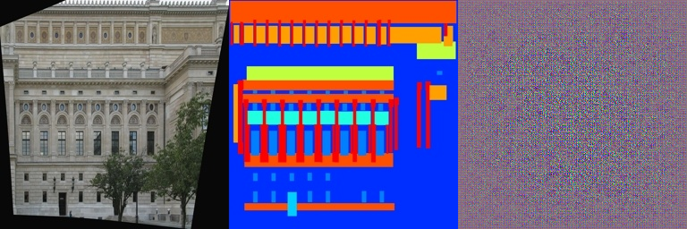

**Epoch 50：**
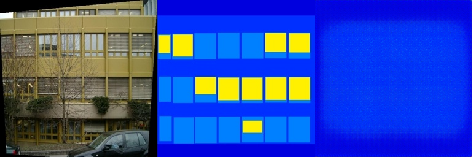

**Epoch 100：**
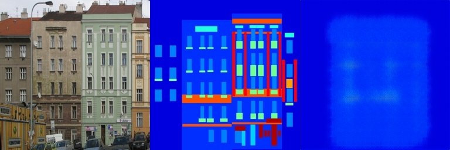

**Epoch 150：**
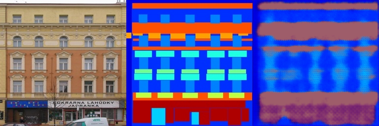

**Epoch 200：**
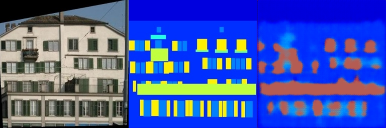

**Epoch 250：**
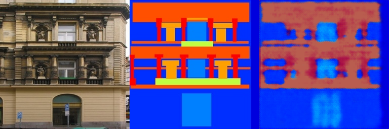

**Epoch 295（最终）：**
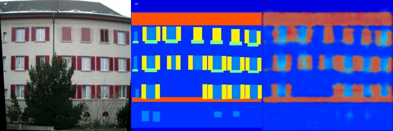

#### 验证集结果

**Epoch 0：**
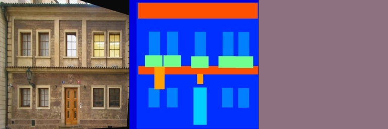

**Epoch 100：**
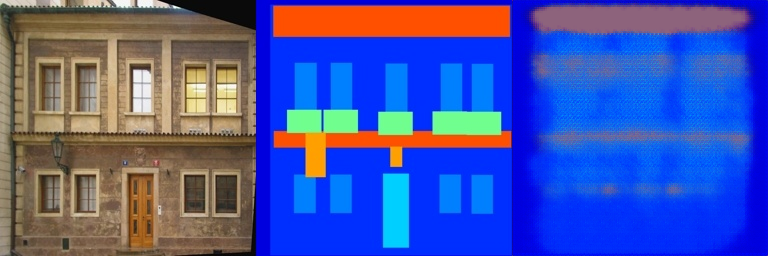

**Epoch 200：**
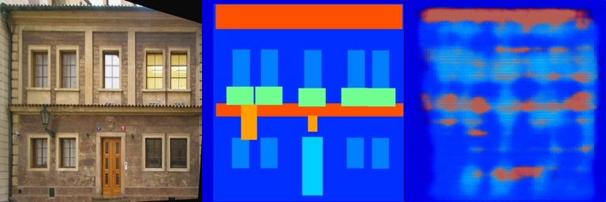

**Epoch 295（最终）：**
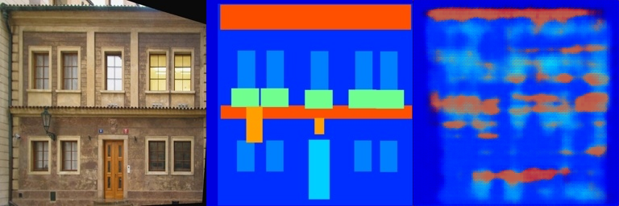

#### 训练分析

| 阶段 | 观察 |
|------|------|
| Epoch 0 | 输出为随机噪声，模型尚未学到任何映射关系 |
| Epoch 50–100 | 开始出现模糊的语义区域，大致的颜色分布可见 |
| Epoch 150–200 | 结构逐渐清晰，窗户、门等细节开始可辨 |
| Epoch 250–295 | 输出接近目标标注，语义边界较为准确 |

### 5.2 Poisson 融合

#### 融合结果

输入融合的图片,并选中融合区域：


图片融合输出结果，拉动纵向位置和横向位置改变融合区域：


---

## 六、运行方式

**训练 Pix2Pix：**
```bash
cd Pix2Pix
bash download_facades_dataset.sh   # 下载数据集
python train.py                    # 开始训练
```

**运行 Poisson 融合：**
```bash
cd "Poisson Image Blending"
jupyter notebook "Poisson Image Blending.ipynb"
# 访问 http://127.0.0.1:7864
```

