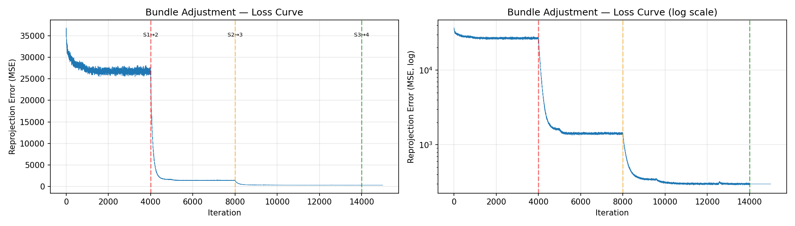
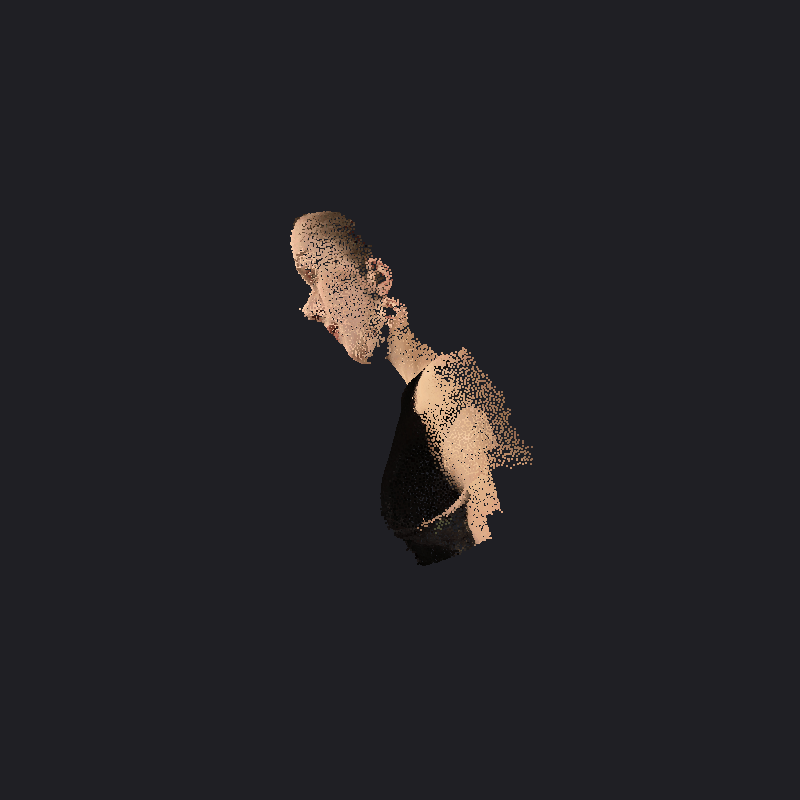
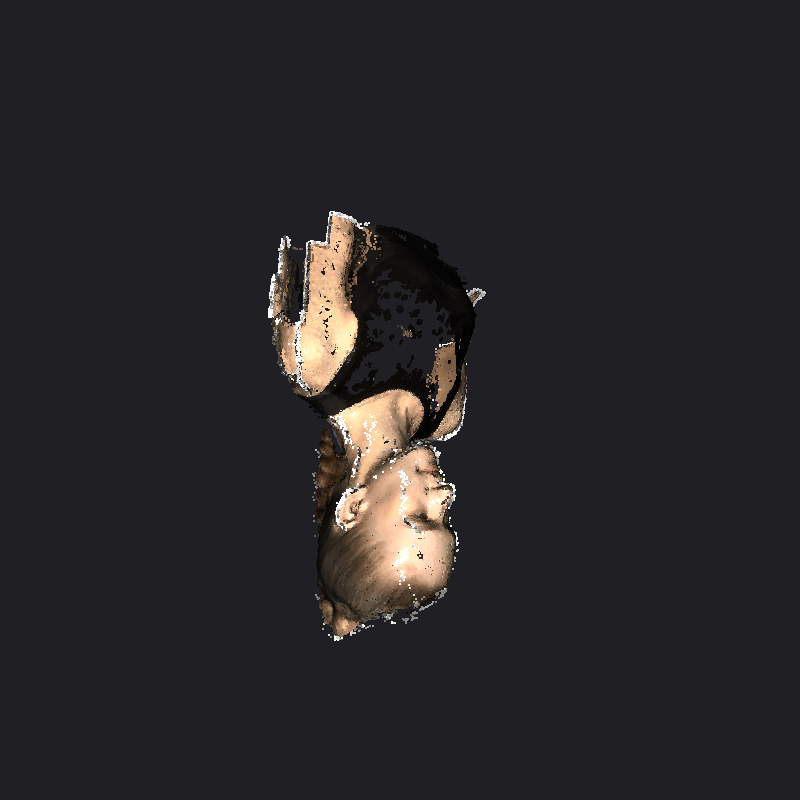

# 数字图像处理作业三：Bundle Adjustment

学号：BC25038003  姓名：唐晓刚

---

## Abstract

本作业实现了 Bundle Adjustment（光束法平差）的完整流程：(1) 使用 PyTorch 从零实现 BA 优化，从 50 个视角的 20,000 个 2D 观测点中恢复相机参数和 3D 点云；(2) 使用 COLMAP 对多视角图像进行完整的 SfM 三维重建。

## Installation

```bash
# 创建 conda 环境
conda create -n ba python=3.10 -y
conda activate ba

# 安装依赖
pip install torch numpy matplotlib opencv-python tqdm pillow open3d

# COLMAP (Task 2)
```

## Training (Task 1: PyTorch BA)

从 2D 观测直接优化相机参数和 3D 点云：

```bash
# Python 脚本（~2 分钟，GPU）
python bundle_adjustment.py

# 或 Jupyter Notebook
jupyter notebook bundle_adjustment.ipynb
```

**优化策略**：四阶段 Adam 优化 + CosineAnnealingWarmRestarts，mini-batch size = 5000 点。

| Stage | 优化参数 | Iterations | LR |
|-------|---------|-----------|-----|
| S1 | 相机 (f, R, T) | 4,000 | 3e-3 |
| S2 | 3D 点 (P) | 4,000 | 5e-3 |
| S3 | 全部联合 | 6,000 | 相机 5e-4 / 点 2e-3 |
| S4 | 全批次精调 | 1,000 | 相机 1e-4 / 点 5e-4 |

## Evaluation / Results

### Task 1: PyTorch BA





### Task 2: COLMAP

重建流程（`bash run_colmap.sh`）：

1. 特征提取 (SIFT) → 2. 特征匹配 (Exhaustive) → 3. 稀疏重建 (Mapper) → 4. 稠密重建 (PatchMatch Stereo + Fusion)



## Results

| 指标 | PyTorch BA (Task 1) | COLMAP (Task 2) |
|------|--------------------|--------------------|
| 焦距 fx | 854.4 px | 890.7 px |
| FoV | 61.9° | 58.0° |
| 3D 点数 | 20,000 | 1,710 (稀疏) / 112,511 (稠密) |
| 重投影误差 RMSE | 17.27 px | 0.664 px |
| 优化器 | Adam | Ceres LM |
| 初始化 | 随机/反投影 | SIFT + 增量式 SfM |

## Pre-trained / Output Files

| 文件 | 说明 |
|------|------|
| `output/reconstructed.obj` | Task 1 带颜色 3D 点云 (MeshLab 可打开) |
| `output/ba_parameters.pt` | Task 1 优化参数 (f, R, T, points) |
| `output/task1_pytorch_ba.gif` | Task 1 重建结果旋转动图 |
| `output/loss_curve.png` | Task 1 优化损失曲线 |
| `data/colmap/dense/fused.ply` | Task 2 COLMAP 稠密点云 |
| `data/colmap/sparse/0/` | Task 2 COLMAP 稀疏重建 |
| `output/task2_colmap.gif` | Task 2 重建结果旋转动图 |
