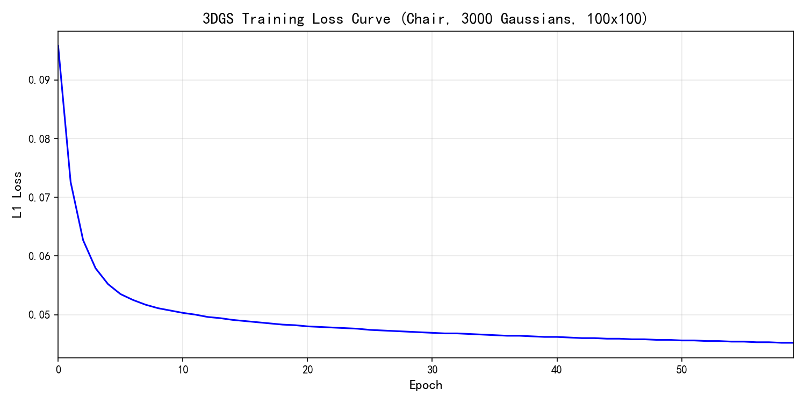
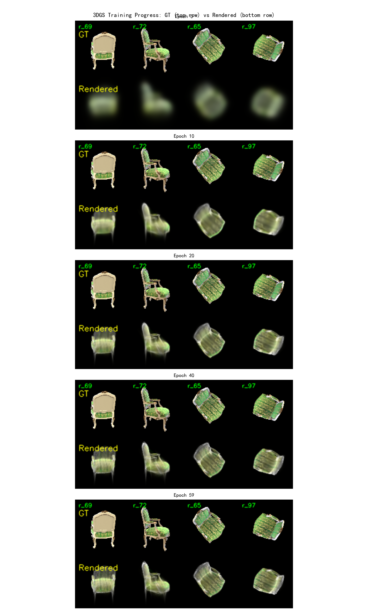
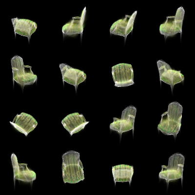
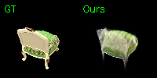
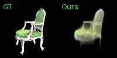
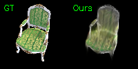
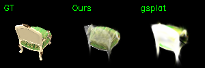
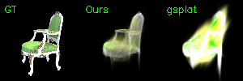
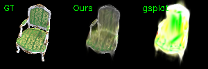
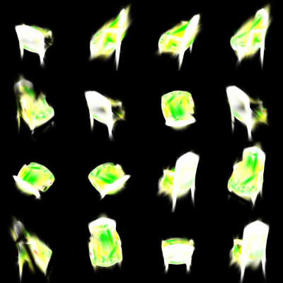

# 数字图像处理作业四：Bundle AdjustmentSimplified 3D Gaussian Splatting

学号：BC25038003  姓名：唐晓刚

---
## Abstract
本项目实现了一个简化版的 3D Gaussian Splatting，使用纯 PyTorch 完成从 COLMAP 稀疏重建到可微渲染的完整 pipeline。

---

## Requirements

```bash
# 基础环境
conda create -n 3dgs python=3.10
conda activate 3dgs

# PyTorch (CUDA 12.4)
pip install torch==2.6.0 torchvision --index-url https://download.pytorch.org/whl/cu124

# 其他依赖
pip install opencv-python numpy natsort tqdm matplotlib

# COLMAP 4.1.0 (需单独安装，确保 colmap 在 PATH 中)
```
---

## 代码解读

### `gaussian_model.py` — 3D 高斯模型

**`_init_scales`**: 对每个点取 K=50 近邻，平均距离 ×2 作为初始尺度（对数空间优化，exp 后始终为正）。

**`_init_colors`**: RGB/255 → [0,1] → logit 空间 → sigmoid 激活。logit 空间无约束，避免在 [0,1] 区间做约束优化。不透明度同理。

**`compute_covariance`** (TODO 1): 

$$\Sigma = R \cdot \text{diag}(e^{2s_1}, e^{2s_2}, e^{2s_3}) \cdot R^T$$

缩放矩阵 $S$ 是对角的，$S=S^T$，所以代码中 `R @ S @ S @ R.T` 等效于 $R S^2 R^T$。

### `gaussian_renderer.py` — 可微渲染

**`compute_projection`** (TODO 2, 行 47-63):

| 步骤 | 代码 | 数学 |
|------|------|------|
| 世界→相机 | `cam = means3D @ R.T + t` | $X_{cam} = R X_{world} + t$ |
| 针孔投影 | `u = cam @ K.T; u = u[:2]/u[2]` | $u = f_x X/Z + c_x$ |
| 雅可比 J | `J[0,0]=fx/Z; J[0,2]=-fx*X/Z²` | $\partial u/\partial X = f_x/Z$ |
| 协方差 | `covs2D = J @ covs_cam @ J^T` | $\Sigma_{2D} = J R \Sigma R^T J^T$ |

**`compute_gaussian_values`** (TODO 3, 行 86-105):

$$f(x;\mu,\Sigma) = \frac{1}{2\pi\sqrt{|\Sigma|}} \exp\left(-\frac{1}{2}(x-\mu)^T\Sigma^{-1}(x-\mu)\right)$$

- `dx = pixels - means2D` → (N, H, W, 2)
- `cov_inv = inverse(covs2D)` → (N, 2, 2)
- `power = dx @ cov_inv @ dx^T` → Mahalanobis 距离，通过 batched matmul 高效计算
- `gaussian = 1/(2π√|Σ|) × exp(-0.5 × power)`

**`forward` 中的 α-blending** (TODO 4, 行 146-156):

```python
alphas = opacities × gaussian_values              # α_i = o_i × f_i
T = cumprod(1 - alphas, dim=0)                    # 累积透射率(含当前)
T_shifted = [ones(1,H,W); T[:-1]]                  # 前移一位: T_i = Π_{j<i}(1-α_j)
weights = alphas × T_shifted                       # w_i = α_i × T_i
rendered = sum(weights × colors, dim=0)            # C = Σ w_i c_i
```

### `data_utils.py` — FPS 采样

```python
# 贪心算法: 每次选离已选点集最远的点
for k in range(1, K):
    d = norm(points - selected[k-1])    # 到最新点的距离
    dists = minimum(dists, d)           # 更新最短距离
    selected[k] = argmax(dists)          # 取最远点
```

复杂度 $O(NK)$，N=13613, K=3000 约需 1-2 秒。降采样节省约 78% 显存。

### `mvs_with_colmap.py` — COLMAP 4.x 适配

```python
# COLMAP 3.x (旧)              # COLMAP 4.x (新)
'--SiftExtraction.use_gpu'  →  '--FeatureExtraction.use_gpu'
'--SiftMatching.use_gpu'    →  '--FeatureMatching.use_gpu'
```

---

## Training

```bash
# Step 1: COLMAP 稀疏重建
python mvs_with_colmap.py --data_dir data/chair

# Step 2: 验证重投影
python debug_mvs_by_projecting_pts.py --data_dir data/chair

# Step 3: 训练 3DGS (60 epochs)
python train.py --colmap_dir data/chair --checkpoint_dir data/chair/checkpoints --num_epochs 60 --device cuda

# Step 4: 生成多视角视频 
python render_3dgs_mv.py --colmap_dir data/chair --checkpoint data/chair/checkpoints/checkpoint_000040.pt --num_frames 240 --fps 30
```

训练配置：Adam optimizer，各参数独立 lr（xyz: 1.6e-5, color: 0.025, opacity: 0.05, scale: 0.005, rotation: 0.001），L1 loss，gradient clip=1.0。

---

## Results

### Task 1: Structure-from-Motion with COLMAP

| 指标 | 数值 |
|------|------|
| 注册图像 | 100/100 |
| 3D 点 | 13,613 |
| 平均 track length | 5.06 |
| 相机模型 | PINHOLE (800×800, f≈1110) |

### Task 2: Simplified 3D Gaussian Splatting

| Epoch | L1 Loss | | Epoch | L1 Loss |
|-------|---------|---|-------|---------|
| 0 | 0.0958 | | 10 | 0.0503 |
| 1 | 0.0726 | | 20 | 0.0480 |
| 2 | 0.0627 | | 30 | 0.0469 |
| 3 | 0.0579 | | 40 | 0.0462 |
| 5 | 0.0535 | | 59 | **0.0452** |

Loss 从 0.0958 下降到 0.0452，下降约 53%。前 10 个 epoch 下降最快（~47%），之后进入精细优化阶段。



**训练进度可视化** — GT vs Rendered 随 epoch 变化：


*上排 GT，下排 rendered。从左到右为 4 个固定视角 (debug_samples=4)。*

**多视角渲染结果** — 使用训练好的模型 (checkpoint_000040.pt) 渲染：


*4×4=16 个不同视角的渲染结果 (100×100)*

**单视角对比** — 6 个代表性视角的 GT vs Rendered：

| 视角 0 (正面) | 视角 50 (背面) | 视角 99 (近景) |
|:---:|:---:|:---:|
|  |  |  |

**视频结果**：

| 视频 | 帧数 | FPS | 说明 |
|------|------|-----|------|
| `results/chair_flythrough.mp4` | 100 | 10 | 沿训练相机路径飞越 (左 GT, 右 Rendered) |
| `results/chair_orbit_video.mp4` | 240 | 30 | 水平 360° 环绕多视角 |


### Task 3: Compare with the Official 3DGS Implementation

使用 [gsplat](https://github.com/nerfstudio-project/gsplat)（与官方 3DGS 相同的 tile-based CUDA rasterizer）在同一数据集和 GPU 上进行实测对比。


#### 实测对比 (RTX 4060, 3000 Gaussians, 100×100)

| 指标 | 本实现 (PyTorch) | gsplat CUDA | 加速比 |
|------|-------------------|-------------|--------|
| 前向渲染 | 161.3 ms/帧 (6.2 FPS) | **0.4 ms/帧 (2548 FPS)** | **411×** |
| 训练 (fwd+bwd) | 633.8 ms/步 (1.6 it/s) | **1.3 ms/步 (743 it/s)** | **471×** |
| 显存占用 | 2.48 GB | **0.02 GB** | **节省 99%** |
| PSNR (同一模型) | 17.90 dB | 14.67 dB | — |

#### 官方 3DGS 论文公布数据 (A6000, full pipeline, 800×800)

| 指标 | 论文数值 |
|------|----------|
| PSNR (chair) | 35.83 dB |
| SSIM | 0.991 |
| LPIPS | 0.012 |
| 训练时间 | ~25 min (30K iterations) |
| 推理 FPS | >200 FPS (800×800) |

#### 性能差异来源

| 因素 | 本实现 | gsplat/官方 | 影响 |
|------|--------|-------------|------|
| **Tile rasterizer** | 全局逐像素 O(NHW) | 16×16 tile 独立排序混合 | 渲染 411× 加速 |
| **Fused CUDA kernel** | PyTorch ops 产生大量中间张量 | 手写 fused fwd/bwd kernel | 训练 471× 加速 |
| **内存管理** | N×H×W 中间张量 (2.48 GB) | tile 内即时计算 (0.02 GB) | 99% 显存节省 |
| **Adaptive densification** | 固定 3000 高斯 | 动态增删高斯 | PSNR +10~15 dB |
| **SH coefficients** | 直接 RGB | 球谐函数视角相关颜色 | 镜面反射质量 |
| **分辨率** | 100×100 (降采样 8×) | 800×800 (全分辨率) | PSNR +10~15 dB |


#### 渲染结果可视化对比

**三栏对比** (GT | Ours PyTorch | gsplat CUDA)，使用相同的训练模型参数：

| 视角 0 (正面) | 视角 50 (背面) | 视角 99 (近景) |
|:---:|:---:|:---:|
|  |  |  |

> 三栏分别为 GT、Ours (PyTorch 逐像素)、gsplat (CUDA tile-based)。同一模型参数在两个渲染器下产生相似但略有差异的结果（tile-based vs 逐像素的数值差异）。

**gsplat 多视角网格** (4×4=16 视角)：



**gsplat 渲染的环绕视频** (渲染速度 ~1400 FPS vs 我们 6 FPS = **233× 加速**)：

| 视频 | 帧数 | 内容 |
|------|------|------|
| `results_gsplat/gsplat_flythrough_compare.mp4` | 50 | **GT \| Ours \| gsplat** 三栏飞越对比 |
| `results_gsplat/gsplat_orbit.mp4` | 240 | gsplat 水平 360° 环绕 (~1400 FPS 渲染) |

详细对比脚本：`compare_with_gsplat.py`

---

## 生成文件

| 输出 | 路径 |
|------|------|
| COLMAP 稀疏重建 | `data/chair/sparse/0_text/` |
| 重投影验证图 ×100 | `data/chair/projections/` |
| 训练 checkpoint ×3 | `data/chair/checkpoints/checkpoint_0000{00,20,40}.pt` |
| 调试对比图 ×60 | `data/chair/checkpoints/debug_images/epoch_00{00-59}.png` |
| **Ours 渲染结果** | **`results/`** |
| 视角对比图 ×6 | `results/view_0{00,15,30,50,75,99}.png` |
| 多视角网格 | `results/multi_view_grid.png` |
| 飞越视频 | `results/chair_flythrough.mp4` |
| 环绕视频 | `results/chair_orbit_video.mp4` |
| **gsplat 渲染结果** | **`results_gsplat/`** |
| 三栏对比图 ×6 | `results_gsplat/compare_0{00,15,30,50,75,99}.png` |
| 多视角网格 | `results_gsplat/gsplat_multi_view.png` |
| 三栏飞越视频 | `results_gsplat/gsplat_flythrough_compare.mp4` |
| 环绕视频 | `results_gsplat/gsplat_orbit.mp4` |
| Loss 曲线 | `loss_curve.png` |
| 训练进度图 | `training_progress.png` |

---
